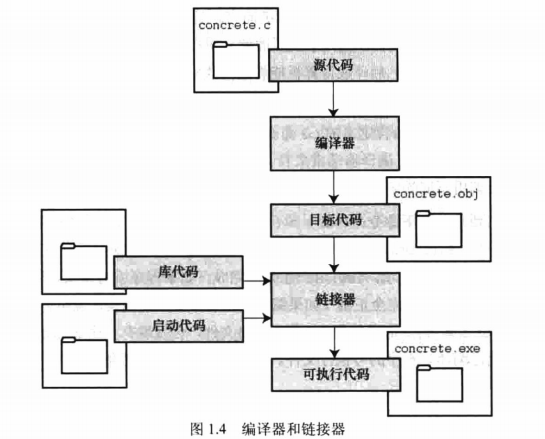

## 第一章
 

1、 C标准————[各种C标准网站](https://zh.cppreference.com/w/c)
 

**$\color{#ea4335}{第一版公认的C标准}$**：《C语言程序设计》
 

**$\color{#ea4335}{C89/C90}$**————第一个ANSI/ISO C标准  
*名称*：ISO/IEC 9899:1990

1983年组建委员会(X3J11)，开发一套新标准，于1989年正式公布。 
该标准定义了C语言和C标准库，国际标准化组织于1990年采用了这套C标准(ISO C)
 
 
*ISO C和ANSI C*是完全相同的标准。 
ANSI/ISO标准的最终版本通常叫C89(因为ANSI于1989年批准该标准) 
&emsp;&emsp;&emsp;&emsp;&emsp;&emsp;&emsp;&emsp;&emsp;&emsp;&emsp;&emsp;
又叫C90(因为ISO于1990年批准该标准) 
又由于ANSI先公布C标准，因此业界人士通常使用ANSI C
 

**$\color{#ea4335}{C95}$** 
这是对 C89 的一个修订和扩充，称为“C89 with Amendment 1”或 C95，严格说来并不是一个真正的标准。
 

**$\color{#ea4335}{C99}$** 
*名称*：ISO/IEC 9899:1999 
1994年ANSI/ISO联合委员会(C9X委员会)开始修订C标准，最终发布了C99标准

**$\color{#ea4335}{C11}$** 
*名称*：ISO/IEC 9899:2011 
标准委员会在2007年承诺C标准的下一个版本C1X，2011年发布C11标准。 
C99的一些特性成为C11的可选项

**$\color{#ea4335}{C17}$** 
*名称*：ISO/IEC 9899:2018 
又称 C17/C18 （分别代表完成和出版的年份

**$\color{#ea4335}{C23}$**
未发布

**$\color{#00BFFF}{注}$**： 
ISO：International Organization for Standardization&emsp;国际标准化组织 
IEC：International Electro technical Commission&emsp;&emsp;&nbsp;&nbsp;国际电工委员会 
ANSI：American National Standards Institute&emsp;&emsp;&emsp;&nbsp;&nbsp;&nbsp;美国国家协会 

---
 
2、 
